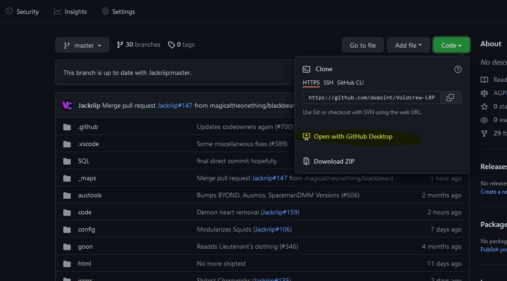

# Cloning the Repo so you can Map

Step 1) Download Github Desktop.



Step 2) Open your fork in github desktop

Step 3) From Github desktop make a new branch, then make sure your on your new branch

.png>)

## Great! Now that you have your branch we can get into StrongDMM
